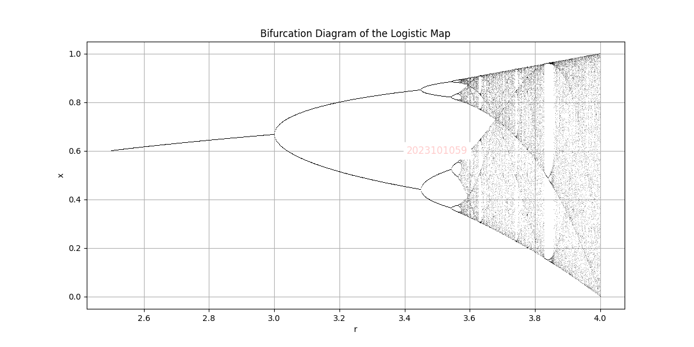
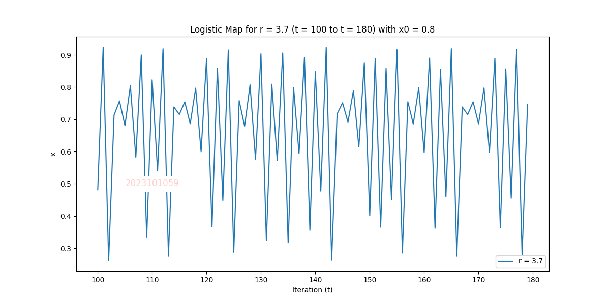
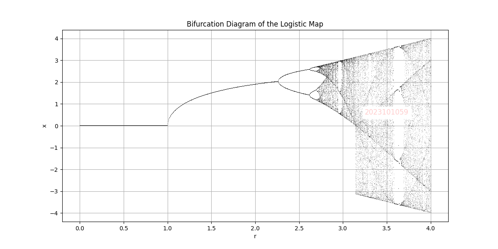

# **🌌 Chaos and Bifurcations**


This project explores **chaos theory** and **bifurcations** through visualizations of the **logistic map** and **bifurcation diagrams**. Using Python, it implements mathematical models to demonstrate how simple nonlinear dynamical systems exhibit **complex behaviors** as system parameters vary.

✨ _This project was part of the_ `Science-1` _course at IIIT-Hyderabad._

---

## **👨‍💻 Author**
- **Shreyas Mehta**

---

## **📂 Directory Structure**
```plaintext
Chaos-and-Bifurcations/
├── bifurcation_diagram_CosineCurve.png
├── bifurcation_diagram_SinosudalCurve.png
├── logistic_map_2023101059_last1.png
├── README.md                                       # 📖 This file
├── bifurcation_diagram_sine.py                     # 🐍 Code for bifurcation diagrams (sinusoidal map)
├── logistic_map_visualization.py                   # 🐍 Code for visualizing logistic maps
└── Results-Img/                                    # 📁 Output images folder
    ├── bifurcation_diagram_2023101059.png
    ├── bifurcation_diagram_sineCurve1.png
    ├── logistic_map_2023101059_last1.png
    ├── logistic_map_2023101059_last2.png
    ├── logistic_map_2023101059_last3.png
    ├── logistic_map_2023101059_start1.png
    ├── logistic_map_2023101059_start2.png
    └── logistic_map_2023101059_start3.png
```

---

## **✨ Features**
- 🔍 **Generate Bifurcation Diagrams** for **logistic** and **sinusoidal maps**.  
- 📈 **Visualize Logistic Map Dynamics** with parameters `r` and `x0`.  
- 🌟 **Demonstrate Chaotic Behavior** and **Periodic Orbits** in dynamic systems.  
- 💾 **Save Results** as high-quality images for further analysis.  

---

## **🐍 Python Files**

### 1. **`bifurcation_diagram_sine.py`**
Generates a **bifurcation diagram** by iterating a sinusoidal variant of the logistic map:  
\[
x(t+1) = r \cdot \sin(x(t))
\]

**🔑 Key Features**:
- Iterates through a range of system parameter `r`.  
- Plots **bifurcation points** to visualize transitions to chaos.  
- Highlights how sinusoidal maps exhibit **chaotic behavior** at certain thresholds.  

**📁 Output**:  
- `bifurcation_diagram_sineCurve1.png`

---

### 2. **`logistic_map_visualization.py`**
Visualizes the behavior of the classic **logistic map**:  
\[
x(t+1) = r \cdot x(t) \cdot (1 - x(t))
\]

**🔑 Key Features**:
- Simulates system behavior for different values of `r` and initial state `x0`.  
- Visualizes **periodic orbits** and **chaotic regimes** over specified iterations.  
- Allows comparison of behaviors for different parameters.  

**📁 Outputs**:  
- `logistic_map_2023101059_last1.png`  
- `logistic_map_2023101059_start1.png`  
- Other visualizations in the `Results-Img/` folder.  

---

## **🚀 How to Run the Project**

1. Clone the repository:  
   ```bash
   git clone https://github.com/shreyasMehta05/Chaos-and-Bifurcations.git
   cd Chaos-and-Bifurcations
   ```

2. Install dependencies:  
   ```bash
   pip install matplotlib numpy
   ```

3. Run the scripts:  
   - **To generate the bifurcation diagram**:  
     ```bash
     python3 bifurcation_diagram_sine.py
     ```  
   - **To visualize logistic map dynamics**:  
     ```bash
     python3 logistic_map_visualization.py
     ```  

4. View the output images in the **`Results-Img/` folder**.

---

## **📊 Results**

### 1. **Bifurcation Diagram for Logistic Map**  
  

### 2. **Logistic Map Dynamics**  
  

### 3. **Bifurcation Diagram for Sinusoidal Map**  
  

---

Enjoy exploring the **chaos**! 🌀